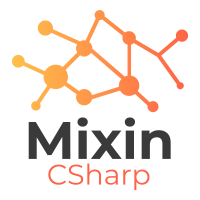

# Mixin-SDK-CSharp

## Mixin.Network

### [Installation](https://www.nuget.org/packages/Mixin.Network/)

实现了全部 Network API。代码示例在 [Mixin.Network.Example](src\Mixin.Network.Example) 项目中

## Mixin.Messenger

### [Installation](https://www.nuget.org/packages/Mixin.Messenger/)

实现了 Messenger API，包含用户相关 API 和 Websocket 相关 API。

* User 相关代码示例：[Mixin.Messenger.REST.Example](src\Mixin.Messenger.REST.Example)
* Websocket 相关代码示例：[Mixin.Messenger.WebSocket.Examples](src\Mixin.Messenger.WebSocket.Example)

## API Reference

See http://docs.watfaq.com/

**注意**： 本仓库示例代码中所使用的配置信息，包括 clientSecret 和私钥均为示例用途。请不要向其地址转账。损失后果自负。